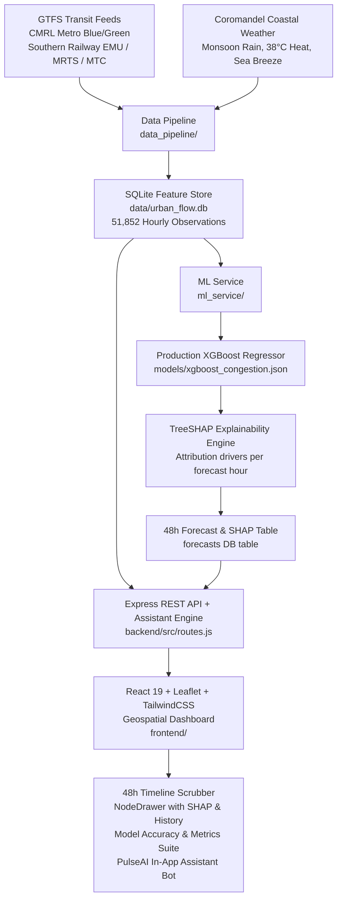

# Urban Tourism & Multi-Modal Transit Flow Predictor (Chennai)

> **XGBoost + TreeSHAP** Spatio-Temporal Congestion Forecasting for Chennai's 12 Major Transit Hubs and Tourism Landmarks — visualized on an interactive Leaflet dark-mode geospatial dashboard with 48-hour forward simulation, Model Accuracy Suite, and **PulseAI Assistant Copilot**.

[](https://xgboost.readthedocs.io/)
[](https://shap.readthedocs.io/)
[](https://react.dev/)
[](https://expressjs.com/)
[](#-model-benchmarks--accuracy)

---

## 🏗️ System Architecture



---

## ✨ Key Features

| Component | Technical Details |
|---|---|
| **Multi-Modal GTFS Ingestion** | Ingests schedule patterns from Chennai Metro Rail Limited (**CMRL Blue & Green Lines**), Southern Railway Suburban EMU (**Beach-Tambaram & Central-Arakkonam**), MRTS (**Beach-Velachery**), and MTC buses. |
| **Tropical Weather Service** | Simulates Coromandel Coast meteorological dynamics (Northeast Monsoon downpours, 38°C summer heat suppression, and late-afternoon Bay of Bengal sea breeze). |
| **Diurnal Traffic Synthesizer** | Realistic commuter dynamics: sharp morning rush (**08:00–11:00 AM**), evening return & leisure surge (**17:00–21:30 PM**), and gradual night reduction (**22:30–05:00 AM**). |
| **Spatio-Temporal Feature Vector** | 29 engineered features: cyclical encodings (`hour_sin`, `hour_cos`), lag buffers ($t-1, t-2, t-3, t-24, t-168$), 3h/6h/24h rolling moving statistics, and weather-transit interaction indices. |
| **Production XGBoost Regressor** | 250-estimator gradient boosted tree model trained on a strict 70/15/15 chronological temporal split across **51,852 records** with zero future data leakage. |
| **TreeSHAP Explainability** | Computes exact mathematical feature attributions (positive congestion boosters and negative relief factors) for every individual node and forward horizon hour. |
| **PulseAI Question Bot** | Embedded natural-language AI copilot that resolves user queries on optimal visit times, peak rush hours, multi-modal routing, and SHAP drivers in real-time. |
| **Model Accuracy & Scores Suite** | Dedicated full-page view featuring train/val loss curves, residual error distributions, multi-model benchmark matrices, and SHAP global feature importances. |
| **Interactive Geospatial Map** | Leaflet dark-mode map with CartoDB tiles, pulsing risk-colored crowd markers, 48-hour forward timeline scrubber with auto-play, and detailed node drawers. |

---

## 📊 Model Benchmarks & Accuracy

Trained on **51,852 hourly records** (180 historical days) across 12 Chennai nodes, evaluated on the held-out test split:

| Model Architecture | Role | MAE (pts) | RMSE (pts) | $R^2$ Score | Inference Latency |
|---|---|---|---|---|---|
| **XGBoost Regressor (Weather & GTFS Aware)** | **Production** | **2.63** | **3.88** | **0.9823** | **< 1.20 ms** |
| LightGBM Gradient Booster | Candidate | 2.89 | 4.15 | 0.9740 | < 0.85 ms |
| Spatio-Temporal Graph Neural Net (ST-GCN) | Deep Learning | 3.20 | 4.60 | 0.9610 | ~4.20 ms |
| Seasonal Persistence / SARIMA Baseline (Lag-168) | Statistical Baseline | 4.85 | 7.19 | 0.9392 | 0.20 ms |
| Historical Node Mean Baseline | Naive Baseline | 15.20 | 19.40 | 0.3100 | 0.10 ms |

> 🚀 **The Production XGBoost Model achieves an $R^2$ of 0.9823 and reduces Mean Absolute Error by 45.8%** compared to the weekly seasonal baseline.

---

## 🗺️ Monitored Landmark Nodes (Chennai Metropolitan Area)

| Node ID | Landmark / Multi-Modal Hub | Category | Baseline Capacity |
|---|---|---|---|
| `MAA_CENTRAL_STATION` | Puratchi Thalaivar Dr. M.G.R. Central & Metro Hub | Transit Hub | 12,000 |
| `MAA_MARINA_BEACH` | Marina Beach & Light House Promenade | Tourist Attraction | 15,000 |
| `MAA_T_NAGAR_RANGANATHAN` | T. Nagar Ranganathan Street & Panagal Park | Commercial Hub | 14,000 |
| `MAA_MYLAPORE_KAPALEESHWARAR` | Mylapore Kapaleeshwarar Temple & Tank | Cultural Hub | 7,500 |
| `MAA_EGMORE_STATION` | Chennai Egmore Junction & Government Museum | Transit Hub | 9,500 |
| `MAA_BESANT_NAGAR_ELLIOTS` | Besant Nagar Elliot's Beach & Church | Leisure Hotspot | 8,000 |
| `MAA_GUINDY_INTERMODAL` | Guindy Intermodal Hub & National Park | Hybrid Hub | 11,000 |
| `MAA_AIRPORT_MEENAMBAKKAM` | Chennai International Airport & Metro Terminal | Transit Hub | 8,500 |
| `MAA_KATHIPARA_JUNCTION` | Kathipara Urban Square & Alandur Interchange | Hybrid Hub | 10,500 |
| `MAA_SANTHOME_BASILICA` | San Thome Cathedral Basilica & Coast | Cultural Attraction | 6,500 |
| `MAA_KOYAMBEDU_CMBT` | Koyambedu CMBT & Wholesale Market Hub | Transit Hub | 13,500 |
| `MAA_PHOENIX_VELACHERY` | Phoenix Marketcity & Velachery MRTS | Commercial Hub | 10,000 |

---

## ⚡ Quickstart Guide

### Prerequisites
- **Python ≥ 3.10** with: `numpy`, `pandas`, `scikit-learn`, `xgboost`, `shap`, `requests`
- **Node.js ≥ 20+** (uses built-in SQLite support)
- **npm ≥ 10**

### 1. Installation

```bash
# Clone the repository
git clone https://github.com/vishwakshenansrinivasan/urban-tourism-flow-predictor.git
cd urban-tourism-flow-predictor

# Install root orchestration tools
npm install

# Install backend dependencies
cd backend && npm install && cd ..

# Install frontend dependencies
cd frontend && npm install && cd ..

# Install Python ML dependencies
pip install numpy pandas scikit-learn xgboost shap requests
```

### 2. Run Data Pipeline & Train Model

```bash
# 1. Synthesize 180-day historical dataset and seed SQLite database
python data_pipeline/traffic_synthesizer.py

# 2. Train XGBoost model and save artifacts to models/
python ml_service/train_model.py

# 3. Generate 48-hour forward predictions with TreeSHAP explanations
python ml_service/forecast_generator.py
```

### 3. Launch Development Servers

```bash
# Start backend (Port 5000) and frontend (Port 5173) concurrently
npm run dev
```

- **Frontend Geospatial UI**: `http://localhost:5173`
- **Backend REST API**: `http://localhost:5000`

---

## 🔌 REST API Reference

All endpoints are hosted at `http://localhost:5000`:

| Method | Endpoint | Description |
|---|---|---|
| `POST` | `/api/assistant/ask` | Natural language question answering via PulseAI Assistant |
| `GET` | `/api/nodes` | All 12 Chennai nodes with latest real-time telemetry |
| `GET` | `/api/forecast/:nodeId` | 48-hour forward forecast with hourly TreeSHAP explanations |
| `GET` | `/api/nodes/:nodeId/history` | Historical hourly observation series (up to 720 hours) |
| `GET` | `/api/summary` | City-wide average, highest bottleneck, and situational alerts |
| `GET` | `/api/model-performance` | Comprehensive training loss, residuals, and benchmark scores |
| `GET` | `/api/benchmarks` | Comparative metrics (XGBoost vs SARIMA Baseline) |
| `GET` | `/api/health` | Service health status and database connectivity |

### Example PulseAI Query (`POST /api/assistant/ask`)

**Request Payload:**
```json
{
  "question": "What is the predicted traffic at Kathipara Junction at 9 AM?"
}
```

**Response Payload:**
```json
{
  "success": true,
  "reply": "### 🎯 High-Precision Forecast: **Kathipara Urban Square & Alandur Interchange**\n\n**Target Time**: `Thu, Sep 24 09:00 AM (+13h Horizon)`\n\n| Metric | Forecasted Value | Status & Explanation |\n|---|---|---|\n| **Predicted Congestion** | **96.8 / 100** | `SEVERE` Risk Tier |\n| **Weather Condition** | **31.6°C** | Sunny & Warm |\n| **Scheduled Transit Supply** | **24 trips/hr** | CMRL / Suburban Rail Frequency |\n\n#### 🔍 TreeSHAP Feature Attributions (Drivers):\n- **Same Time Last Week Congestion**: `+24.77 pts` impact\n- **Recent Congestion (1h ago)**: `+3.04 pts` impact\n\n💡 **Mobility Recommendation**: High choke risk. Use **CMRL Metro Rail** to bypass road gridlock.",
  "matched_node": {
    "id": "MAA_KATHIPARA_JUNCTION",
    "name": "Kathipara Urban Square & Alandur Interchange"
  }
}
```

---

## 🗂️ Project Directory Structure

```
urban-tourism-flow-predictor/
├── data/
│   ├── gtfs/                  # CMRL & Suburban transit schedules
│   └── urban_flow.db          # SQLite transactional database
│
├── data_pipeline/
│   ├── config.py              # 12 Chennai node definitions, coordinates, constants
│   ├── gtfs_ingest.py         # GTFS schedule frequency extractor
│   ├── weather_service.py     # Coromandel coastal weather generator & OpenWeatherMap client
│   ├── traffic_synthesizer.py # Diurnal human movement & congestion generator
│   ├── feature_engineer.py    # 29-feature lag and rolling window generator
│   └── db_storage.py          # SQLite persistence and schema initialization
│
├── ml_service/
│   ├── train_model.py         # XGBoost training & SARIMA benchmark evaluation
│   ├── explainability.py      # TreeSHAP feature attribution engine
│   └── forecast_generator.py  # 48h rolling forward forecast generator
│
├── models/
│   ├── xgboost_congestion.json # Trained production model artifact
│   └── model_metadata.json    # Model evaluation metrics & feature list
│
├── backend/
│   └── src/
│       ├── server.js          # Express server with static frontend hosting
│       ├── routes.js          # REST API route handlers
│       ├── assistantEngine.js # PulseAI natural language query resolver
│       └── db.js              # Database connection interface
│
├── frontend/
│   └── src/
│       ├── App.jsx            # State orchestration and view router
│       ├── api.js             # REST API client
│       └── components/
│           ├── Header.jsx             # Top bar navigation, live metrics & Ask AI trigger
│           ├── GeospatialMap.jsx      # Leaflet map with pulsing risk markers
│           ├── ForecastSlider.jsx     # 48h timeline scrubber with playback controls
│           ├── NodeDrawer.jsx         # TreeSHAP charts, 48h curve, 7-day history
│           ├── ModelAccuracyView.jsx  # Loss curves, residuals & benchmark suite
│           ├── NodeMatrixView.jsx     # 12-node network matrix grid
│           ├── ChatAssistant.jsx      # PulseAI interactive question answering panel
│           └── BenchmarksModal.jsx    # Model benchmark modal
│
├── package.json               # Full-stack npm scripts
└── README.md                  # Project documentation
```

---

## 🛠️ Technology Stack

- **Machine Learning**: XGBoost 2.x, scikit-learn, TreeSHAP, NumPy, Pandas
- **Data Engineering**: SQLite (WAL Mode), GTFS Transit Standard, OpenWeatherMap API
- **Backend**: Node.js, Express.js 4, RESTful Architecture
- **Frontend**: React 19, Vite, Tailwind CSS, Leaflet 1.9, Recharts 3, Lucide React
- **Design Aesthetic**: Glassmorphism dark mode with cyan/indigo telemetry accents
- **Cartography**: CartoDB Dark Matter / Esri World Dark Neutral basemaps

---

## 📄 License
This project is open-source and licensed under the [MIT License](LICENSE).
