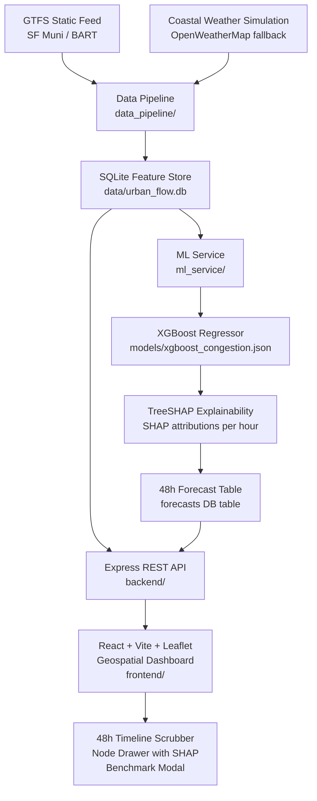

# Urban Tourism & Transit Flow Predictor

> **XGBoost + TreeSHAP** spatio-temporal congestion forecasting for San Francisco's 7 major transit hubs and tourism landmarks — visualised on a live Leaflet dark-mode geospatial dashboard with 48-hour forward simulation.

---

## 🏗️ System Architecture



---

## ✨ Key Features

| Layer | What It Does |
|---|---|
| **GTFS Ingestion** | Parses SF Muni / BART stop_times to derive scheduled trip frequency per node, day-of-week, and hour |
| **Weather Simulation** | Generates realistic 90-day coastal SF microclimate series (temp, humidity, precipitation, fog) or fetches live OpenWeatherMap data |
| **Traffic Synthesizer** | Produces diurnal + seasonal 90-day historical foot-traffic and congestion records for all 7 nodes |
| **Feature Engineering** | 29-feature vector: cyclical time encodings, lag features (t-1, t-24, t-168), 3/6/24h rolling statistics, weather + GTFS features |
| **XGBoost Model** | 250-estimator gradient boosted regressor (0–100 congestion scale) trained on 70/15/15 temporal split with zero data leakage |
| **Seasonal Baseline** | SARIMA-proxy benchmark using weekly lag-168 seasonal persistence for model evaluation comparison |
| **TreeSHAP** | Per-prediction, per-hour SHAP attributions mapped to human-readable urban transit driver labels |
| **48h Forecast** | Rolling autoregressive multi-step forecast for all 7 nodes with per-hour SHAP explanations |
| **REST API** | Express.js REST endpoints for nodes, forecasts, history, summary, benchmarks, and health |
| **Geospatial Dashboard** | Leaflet dark-map + CartoDB tiles with crowd density circles, custom risk markers, 48h scrubber, NodeDrawer with SHAP charts |

---

## 📊 Model Benchmarks

Trained on **~15,000 hourly records** across 7 nodes, with temporal cross-validation (no leakage):

| Model | MAE | RMSE | R² |
|---|---|---|---|
| **XGBoost Regressor** (Production) | **4.29** | **5.57** | **0.941** |
| Seasonal Persistence / SARIMA Baseline | 5.86 | 7.92 | 0.881 |

> **XGBoost reduces MAE by ~27% over the seasonal baseline** on the held-out test set.

---

## 🗺️ Monitored Nodes — San Francisco

| ID | Name | Category |
|---|---|---|
| `SF_POWELL_ST` | Powell St Station & Cable Car Turnaround | Transit Hub |
| `SF_FISHERMANS_WHARF` | Fisherman's Wharf & Pier 39 | Tourist Attraction |
| `SF_EMBARCADERO` | Ferry Building & Embarcadero Station | Hybrid Hub |
| `SF_UNION_SQUARE` | Union Square Plaza | Commercial Hub |
| `SF_MISSION_DOLORES` | Mission Dolores Park & 16th St | Leisure Hotspot |
| `SF_GOLDEN_GATE_PARK` | Golden Gate Park Concourse (de Young & Cal Academy) | Cultural Attraction |
| `SF_CHINATOWN_GATE` | Chinatown Dragon Gate & Rose Pak Station | Cultural Hub |

---

## ⚡ Quickstart

### Prerequisites
- Python ≥ 3.10 with: `numpy pandas scikit-learn xgboost shap`
- Node.js ≥ 22 (uses built-in `node:sqlite`)
- npm ≥ 10

### 1. Install dependencies

```bash
# Root orchestration tools
npm install

# Backend
cd backend && npm install && cd ..

# Frontend
cd frontend && npm install && cd ..

# Python ML dependencies
pip install numpy pandas scikit-learn xgboost shap
```

### 2. Run the full data pipeline

```bash
# Generates 90-day historical data, initializes DB, seeds GTFS
npm run pipeline
```

### 3. Train the XGBoost model

```bash
npm run train
```

### 4. Generate 48-hour forecasts with SHAP

```bash
npm run forecast
```

### 5. Start the development servers

```bash
npm run dev
# Backend:  http://localhost:5000
# Frontend: http://localhost:5173
```

### 6. Production build (full-stack from one port)

```bash
npm run build
NODE_ENV=production npm run start
# Everything available at: http://localhost:5000
```

---

## 🔌 REST API Reference

All endpoints served from `http://localhost:5000`:

| Method | Endpoint | Description |
|---|---|---|
| `GET` | `/api/health` | Service health + database record counts |
| `GET` | `/api/nodes` | All 7 nodes with latest real-time status |
| `GET` | `/api/forecast/:nodeId` | 48-hour forecast with hourly SHAP attributions |
| `GET` | `/api/nodes/:nodeId/history` | Up to 720h of hourly observations |
| `GET` | `/api/summary` | City-wide average, highest bottleneck, peak forecast |
| `GET` | `/api/benchmarks` | XGBoost vs Baseline evaluation metrics |

### Example response — `/api/forecast/SF_POWELL_ST`

```json
{
  "success": true,
  "node": { "id": "SF_POWELL_ST", "name": "Powell St Station & Cable Car Turnaround" },
  "horizon_hours": 48,
  "forecast": [
    {
      "horizon_hour": 1,
      "forecast_timestamp": "2026-09-23T12:00:00+00:00",
      "predicted_congestion": 37.4,
      "risk_level": "MODERATE",
      "temp_c": 14.2,
      "weather_condition": "Partly Cloudy",
      "scheduled_trips": 18,
      "shap_base_value": 53.02,
      "top_positive_factors": [
        { "feature_name": "Rainfall Intensity", "impact": 2.2, "feature_value": 0.0 }
      ],
      "top_negative_factors": [
        { "feature_name": "Time of Day (Peak Window)", "impact": -3.1, "feature_value": -0.98 }
      ]
    }
  ]
}
```

---

## 🧪 Verification Suite

Run the full end-to-end verification across all 3 modules:

```bash
npm run verify:all
```

Or individually:

```bash
# Module 1: Data pipeline, GTFS, weather, feature engineering, DB storage
npm run verify:pipeline

# Module 2: XGBoost training, SHAP explainability, 48h forecast generation
npm run verify:ml

# Module 3: All 6 REST API endpoints
npm run verify:api
```

---

## 🗂️ Project Structure

```
urban-tourism-flow-predictor/
├── data/
│   ├── gtfs/                  # SF Muni GTFS static feed files
│   └── urban_flow.db          # SQLite feature store
│
├── data_pipeline/
│   ├── config.py              # Node definitions, paths, constants
│   ├── gtfs_ingest.py         # GTFS stop_times parser → trip frequencies
│   ├── weather_service.py     # Coastal SF weather simulation
│   ├── traffic_synthesizer.py # Historical foot-traffic & congestion generator
│   ├── feature_engineer.py    # 29-feature lag + rolling window builder
│   ├── db_storage.py          # SQLite / PostgreSQL persistence layer
│   └── verify_pipeline.py     # Module 1 automated verification
│
├── ml_service/
│   ├── train_model.py         # XGBoost training + SARIMA benchmark evaluation
│   ├── explainability.py      # TreeSHAP feature attribution module
│   ├── forecast_generator.py  # 48h autoregressive forecast + SHAP persistence
│   └── verify_ml.py           # Module 2 automated verification
│
├── models/
│   ├── xgboost_congestion.json  # Trained XGBoost model artifact
│   └── model_metadata.json      # Metrics, feature list, training timestamp
│
├── backend/
│   ├── src/
│   │   ├── server.js          # Express server + production static serving
│   │   ├── routes.js          # REST API route handlers
│   │   └── db.js              # SQLite / PostgreSQL abstraction layer
│   └── test/
│       └── api_test.js        # Module 3 API integration verification
│
├── frontend/
│   ├── index.html             # SEO-optimised entry point + Google Fonts
│   └── src/
│       ├── App.jsx            # Root state orchestration
│       ├── api.js             # Backend API client
│       ├── index.css          # Glassmorphism theme, Leaflet dark tweaks
│       └── components/
│           ├── Header.jsx          # City metrics header bar
│           ├── GeospatialMap.jsx   # Leaflet CartoDB dark map + crowd circles
│           ├── ForecastSlider.jsx  # 48h timeline scrubber with playback
│           ├── NodeDrawer.jsx      # SHAP chart, 48h curve, 7-day history
│           └── BenchmarksModal.jsx # XGBoost vs baseline metric comparison
│
└── package.json               # Root orchestration scripts
```

---

## 🛠️ Technology Stack

| Layer | Technology |
|---|---|
| **ML Modelling** | XGBoost 2.x, scikit-learn, SHAP (TreeExplainer) |
| **Data** | pandas, numpy, SQLite (node:sqlite built-in), GTFS CSV |
| **Backend** | Node.js 22+, Express 4, Morgan, `node:sqlite` |
| **Frontend** | React 19, Vite 8, Leaflet 1.9, Recharts 3, Tailwind CSS v4, Lucide React |
| **Typography** | Plus Jakarta Sans, JetBrains Mono (Google Fonts) |
| **Map Tiles** | CartoDB Dark Matter (OpenStreetMap data) |

---

## 🗺️ v2 Roadmap

- **ST-GCN Graph Neural Networks** for inter-node spatial dependency modelling
- **Real-time AVL / GPS transit telemetry** ingestion (SFMTA GTFS-RT)
- **Congestion-aware route optimisation** recommendations
- **Multi-city expansion**: New York, Chicago, Los Angeles
- **PostgreSQL + PostGIS** production deployment (already supported in the codebase via `DATABASE_URL`)
